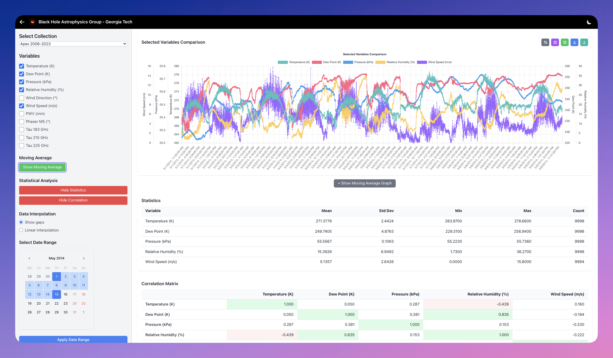

# EHT Weather Analytics Platform 🛰️



### Step 1: Prerequisites

**Recommended Installation via Homebrew (macOS):**

First, install Homebrew via Terminal:
```bash
/bin/bash -c "$(curl -fsSL https://raw.githubusercontent.com/Homebrew/install/HEAD/install.sh)"
```

Then install Git and Docker:
```bash
brew install git
brew install --cask docker
```

Start Docker Desktop from Applications after installation.

**Alternative:** Install [Docker](https://docs.docker.com/get-docker/) directly from the official website


### Step 2: Clone Repository
```bash
# Clone the repository
git clone https://github.gatech.edu/Xtreme-Astrophysics/data_stream.git

# Navigate to the project
cd data_stream

# Make shell scripts executable
chmod +x *.sh
```

### Step 3: Add Your Data

Download the data from Dropbox:
**[Download Weather Data](https://www.dropbox.com/scl/fo/pqxir3n4cbmrgagihh1cb/AKM2OKaeNR6SuEMaZE5puM4?rlkey=lk7uml44wmqa6r0ts1anttcsf&st=ipybe69n&dl=0)**

Create the data directory and place your CSV files there:
```bash
# Create the data directory
mkdir -p data
```

Extract and place your CSV files in the `data/` directory:
```
data/
├── apex_2006_2023.csv
├── glt_2017_2022.csv
├── kittpeak_2019_2024.csv
├── sma_2006_2023.csv
└── ...
```

### Step 4: Build and Start Application
```bash
# Run the automated setup (builds Docker containers, starts services, and imports data)
./setup.sh
```

**This script will:** 
- Build and start all Docker containers
- Wait for all services to be ready  
- Offer to import your CSV data automatically
- Takes a few minutes to complete

Everything is done automatically.

### Step 5: Access the Application
- **Frontend**: http://localhost:3000
- **Backend**: http://localhost:4000/graphql

## That's it! 📡

The application is now running with the data loaded! Woo!

## For Future Use

**IMPORTANT:** After the initial setup, you can use these simpler commands:

```bash
make up          # Start services (quick restart)
make down        # Stop services  
make health      # Check status
make logs        # View logs
```

**First time only:** Use `./setup.sh` (builds everything from scratch)  
**Future starts:** Use `make up` and `make down` (much faster)

Run `make health` to check if all services are running properly.

## CSV Data Format Required

Your CSV files should have these columns:
- `wdatetime` - Date/time string
- `temperature_k` - Temperature in Kelvin
- `dewpoint_k` - Dew point in Kelvin
- `pressure_kpa` - Pressure in kPa
- `relhumidity_pct` - Relative humidity %
- `winddir_deg` - Wind direction in degrees
- `windspeed_mps` - Wind speed in m/s
- `pwv_mm` - Precipitable water vapor in mm
- `phaserms_deg` - Phase RMS in degrees
- `tau183ghz`, `tau215ghz`, `tau225ghz` - Tau values

## Troubleshooting
- Check the full [README.md](README.md)
- Run `./health-check.sh` to diagnose issues
- Or contact me :)
