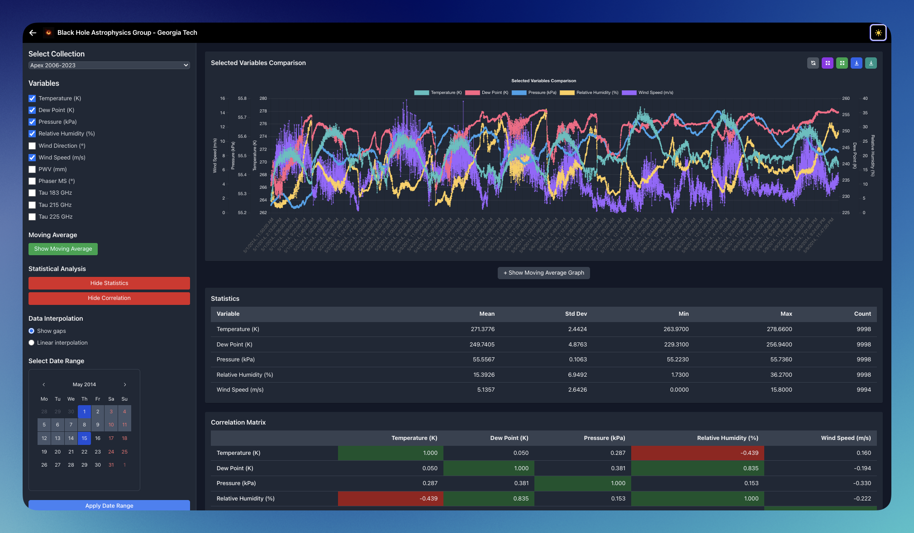

# EHT Weather Analytics Platform

A web-based platform for visualizing and analyzing weather data from multiple telescope sites of the [Event Horizon Telescope](https://en.wikipedia.org/wiki/Event_Horizon_Telescope) (EHT). Easily compare, explore, and analyze weather parameters (temperature, humidity, wind, etc.) across observatories and time ranges.

  <video src="frontend/src/assets/data_stream_new.mp4" autoplay loop muted playsinline width="100%">
    Your browser does not support the video tag.
  </video>
  
<em>Demo</em>

## Tech Stack
- **Frontend:** React, Tailwind CSS, Apollo Client, Chart.js
- **Backend:** Node.js, Express, Apollo Server (GraphQL), Mongoose
- **Database:** MongoDB 
- **Containerization:** Docker, Docker Compose
- **Automation:** Makefile, Shell scripts

## Quickstart
See [QUICKSTART.md](QUICKSTART.md) for a step-by-step setup guide.

1. Install Docker & Git
2. Clone the repo and add your CSV data to the `data/` folder
3. Run `./setup.sh` to build and start everything
4. Access the app at http://localhost:3000

---

  
  
<em>Light Mode</em>

  
  
<em>Dark Mode</em>

---

> Georgia Tech - School of Physics (Black Hole Astrophysics Group)